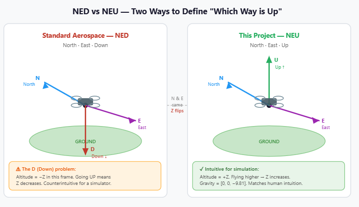
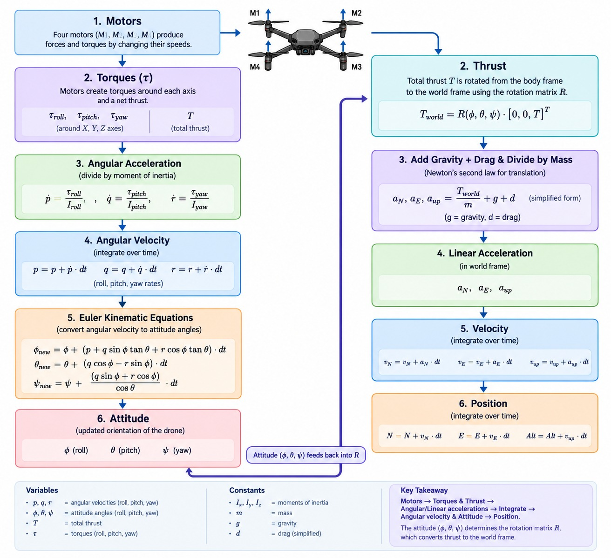
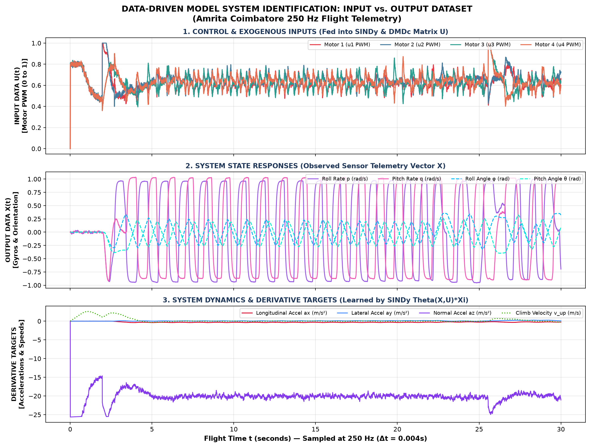
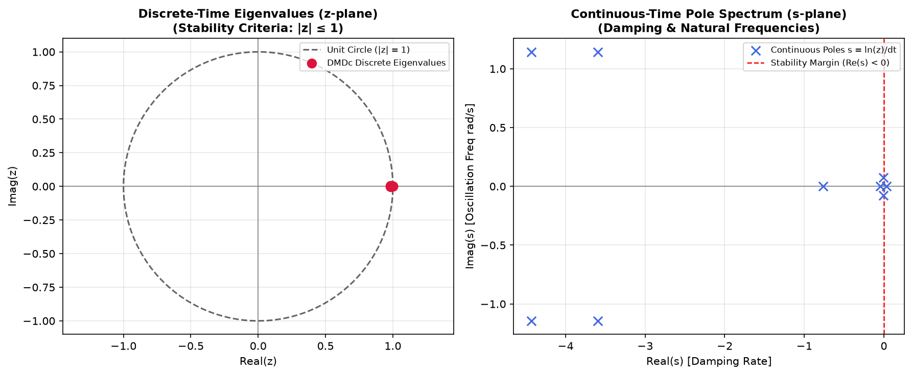
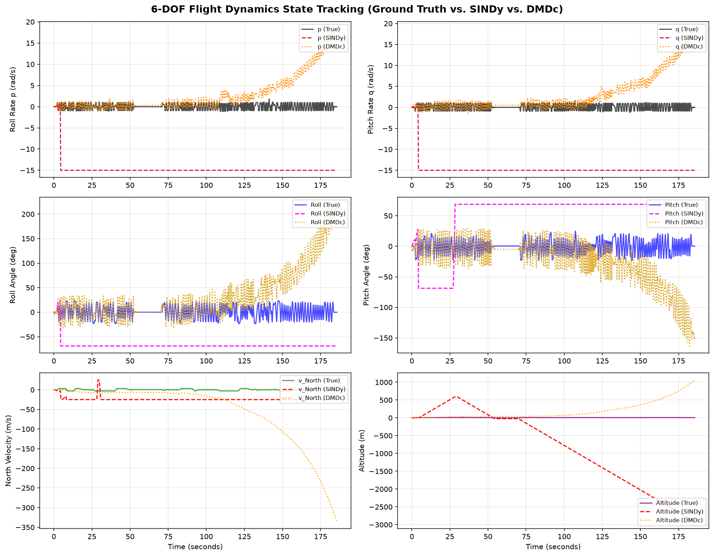

<p align="center">
  
</p>


| Name | Roll No. | Email |
|---|---|---|
|Mamidala Som Praneeth Babu | CB.SC.U4AIE24029 | cb.sc.u4aie24029@cb.students.amrita.edu |
|  | CB.SC.U4AIE24102 | cb.sc.u4aie24102@cb.students.amrita.edu |
| Aravind S Harilal | CB.SC.U4AIE24008 | cb.sc.u4aie24008@cb.students.amrita.edu |
| Yaswant Reddy | CB.SC.U4AIE24061 | cb.sc.u4aie24061@cb.students.amrita.edu |

---


# ESP32 Autonomous Drone Simulator

A full Python simulation of an autonomous quadrotor drone with a Ground Control Station (GCS), voice command interface, cascaded PID flight controller, GPS waypoint navigation, wind disturbance modelling, and a 250 Hz telemetry logger feeding SINDy and DMDc system identification.

---

## Glossary — Every Key Term Defined

These terms appear throughout the codebase and this document. Read this once before diving into the stages.

| Term | Definition |
|------|-----------|
| **6-DOF** | Six Degrees of Freedom — the drone can move in three translational directions (N/E/Up) and rotate in three angular directions (roll/pitch/yaw). Every rigid body in 3D space has exactly these 6. |
| **GCS** | Ground Control Station — the software layer that accepts commands, manages missions, enforces failsafes, and passes targets to the flight controller. The human-facing brain of the system. |
| **Quadrotor** | A rotorcraft with exactly four motors. Unlike a helicopter, it has no tail rotor — yaw is controlled by spinning two motors faster than the other two. |
| **NED** | North–East–Down. The standard aerospace world-frame convention. This project uses NEU (North–East–Up) so that altitude is positive upward, which is more intuitive for simulation. |
| **Body Frame** | A coordinate system fixed to the drone — it tilts and rotates with the vehicle. Motor forces live here. |
| **World Frame** | A coordinate system fixed to the ground — it never moves. GPS positions, gravity, and wind live here. |


| **Euler Angles** | Three angles (roll φ, pitch θ, yaw ψ) that describe how the body frame is rotated relative to the world frame. The standard way to represent orientation in aerospace. |
| **Rotation Matrix (R)** | A 3×3 matrix that transforms any vector from body frame into world frame. Derived from the three Euler angles. Without it, you cannot add thrust and gravity (they live in different frames). |
| **Euler Integration** | The simplest numerical integration: new = old + rate × dt. Used at 250 Hz to advance velocity and position each step. |
| **dt** | Timestep — how much simulated time passes each physics step. Here dt = 0.004 seconds (250 Hz). |
| **250 Hz** | The simulation runs the physics loop 250 times per second. This is fast enough to capture the drone's fastest dynamics without numerical instability. |
| **Thrust** | The upward force produced by spinning propellers. Each motor produces up to 4.0 N; total hover thrust = mass × g = 1.0 × 9.81 = 9.81 N. |
| **Torque (τ)** | A rotational force. Thrust imbalance between left and right motors produces roll torque; front-back imbalance produces pitch torque; reaction torques produce yaw torque. |
| **Moment of Inertia (I)** | How hard it is to rotate the drone. I_roll = I_pitch = 0.012 kg·m². I_yaw = 0.02 kg·m² (harder to spin around the vertical axis because mass is spread wide). |
| **Angular Rate (p, q, r)** | Body-frame angular velocities: p = roll rate, q = pitch rate, r = yaw rate (rad/s). These are what gyroscopes measure. |
| **Hover Thrust** | The total thrust needed to stay still: T_hover = m × g = 9.81 N. Each of the 4 motors runs at 9.81/16 ≈ 61% throttle during steady hover. |
| **Drag** | Aerodynamic resistance. Modelled as F_drag = −k_d × v. Coefficient k_d = 0.06 for both horizontal and vertical axes. |
| **Motor Mixing** | The algebra that converts desired total thrust + three torques into four individual motor throttle commands. Inverts the torque equations. |
| **Reaction Torque** | When a motor spins clockwise, Newton's 3rd law pushes the drone body counter-clockwise. CW and CCW motors are paired diagonally so their reactions cancel for pitch/roll but add for yaw. |
| **PID** | Proportional–Integral–Derivative controller. Computes a corrective output from: current error (P), accumulated past error (I), and rate of error change (D). |
| **Cascaded PID** | Multiple PID loops in series — outer loop output becomes inner loop setpoint. Position → velocity → attitude → angular rate → torques → motors. |
| **Setpoint** | The target value a PID loop is trying to reach (e.g. target altitude, target position). |
| **GPS** | Global Positioning System. The simulator fakes GPS by adding Gaussian noise to the true simulated position (σ ≈ 0.5 m horizontal, 0.8 m vertical). |
| **Flat-Earth** | Approximation that treats the Earth as flat for small distances (<50 km). Converts GPS degrees to metres with: ΔN = Δlat × 111000, ΔE = Δlon × 111000. |
| **Haversine** | The exact spherical-Earth formula for distance between two GPS coordinates. Used for telemetry reporting. The flat-Earth formula is used inside the controller for speed. |
| **Waypoint** | A named 3D target position: (name, north_metres, east_metres, altitude_metres). The mission is an ordered list of waypoints. |
| **RTH** | Return To Home — fly back to the launch point (0, 0) at a safe altitude, then land. Triggered manually or by a failsafe. |
| **Geofence** | A maximum allowed distance from home (100 m). If the drone exceeds this, the GCS forces an RTH regardless of the current mission. |
| **Orbit Mode** | The drone circles a Point of Interest at a fixed radius. Each step, the angular position around the POI advances by ω × dt rad, and the nose always points at the centre. |
| **Vosk** | An offline speech recognition library. Processes raw microphone audio (16000 Hz, mono, 16-bit) and outputs text — no internet required. |
| **TTS** | Text-To-Speech. The simulator uses a persistent PowerShell process running `System.Speech.Synthesis.SpeechSynthesizer` to speak status announcements. |
| **SINDy** | Sparse Identification of Nonlinear Dynamics. A data-driven algorithm that discovers the governing equations of the drone from flight telemetry, using sparse regression (STLSQ). |
| **DMDc** | Dynamic Mode Decomposition with Control. Fits a linear state-space model (x_{k+1} = A·x_k + B·u_k) to flight data. Reveals stability poles and coherent dynamic modes. |
| **STLSQ** | Sequentially Thresholded Least Squares — the sparse regression algorithm inside SINDy. Alternates between least-squares fit and zeroing small coefficients to find the simplest model. |
| **State Vector** | The complete description of the drone at one instant: position (N, E, Up), velocity (vN, vE, vUp), attitude (roll, pitch, yaw), angular rates (p, q, r). 12 numbers total. |
| **Telemetry** | All data logged during flight: state vector + motor commands + wind + battery + sensor readings. Logged at 250 Hz to CSV for post-flight analysis. |
| **Phonetic Matching** | Deliberately mapping speech-recognition mishearings to correct commands — e.g. "you cough" → takeoff, because Vosk often mishears the word "takeoff". |

---

## What Exactly Happens When You Run This Project

This is a step-by-step trace of what the code does from launch to mission completion.

### Step 1 — Startup (`main.py`)

When you run `python -m drone_sim.main`:

1. All physical constants are loaded from `config.py` (mass, arm length, gains, etc.)
2. A `Drone` object is created — position set to (0, 0, 0), all velocities zero, all angles zero
3. A `FlightController` is created with all PID objects initialised
4. A `GCS` object wraps both — it will manage commands and the mission queue
5. The default mission waypoints (A, B, C, D, Home) are loaded into `navigation.py`
6. A voice listener thread starts (if Vosk model is present) — it sits silently waiting for microphone input
7. A TTS announcer thread starts — it opens a background PowerShell pipe to the speech synthesiser
8. A data logger object is created — it will write to a timestamped CSV file once armed
9. The Pygame window opens (in GUI mode), map tiles load, and the main loop begins

### Step 2 — Every Physics Frame (250 times per second)

The main loop runs `drone.step(dt)` — this is where physics lives:

1. **Wind** is sampled from the current wind model (calm/light/strong/storm) and added to the velocity error
2. **Motor torques** are computed from the four motor throttle commands using the mixing equations (τ_roll, τ_pitch, τ_yaw)
3. **Angular accelerations** are found: α = τ / I for each axis
4. **Angular rates** (p, q, r) are updated: p_new = p + α_roll × dt
5. **Euler kinematic equations** convert (p, q, r) → (φ̇, θ̇, ψ̇) → new Euler angles
6. **Rotation matrix R** is recomputed from the new Euler angles
7. **Thrust vector** (pointing up in body frame) is rotated to world frame: F_thrust_world = R × [0, 0, T_total]
8. **Total world-frame force** = F_thrust_world + F_gravity + F_drag
9. **Linear acceleration**: a = F_total / mass
10. **Velocity** and **position** are updated via Euler integration
11. **Simulated sensors** add noise: GPS noise (σ≈0.5m), barometer noise, IMU noise
12. **Battery** depletes based on total motor current draw
13. All 37 state variables are written to the telemetry logger (if armed)

### Step 3 — Flight Controller Update (`controller.py`)

After physics, the GCS calls `controller.update(drone, dt)`:

1. **Altitude PID** reads barometer altitude → computes error vs. target → outputs desired vertical acceleration → becomes thrust command
2. **Position P controller** reads GPS position → computes (ΔN, ΔE) error → multiplies by Kp=0.9 → outputs desired velocity (clamped to ±3 m/s)
3. **Velocity → attitude**: desired velocity is converted into desired roll and pitch angles (clamped to ±20°)
4. **Attitude P controller** reads IMU angles → computes angle errors → multiplies by Kp=7.0 → outputs desired angular rates
5. **Rate PID** reads gyroscope rates → computes rate errors → outputs torque commands
6. **Motor mixing** converts (T_total, τ_roll, τ_pitch, τ_yaw) into M0, M1, M2, M3 ∈ [0, 1]
7. These motor commands are written back to the `Drone` object, which uses them in the next physics step

### Step 4 — GCS Update (`main.py`)

Between physics and controller, the GCS runs its update:

1. **Checks failsafes**: geofence (>100m), battery (<20%→RTH, <10%→land), comms timeout (>5s silence)
2. **Checks waypoint arrival**: if horizontal distance < 2m AND altitude difference < 1.5m, advance to next waypoint
3. **Orbit mode**: if active, computes new orbital position around the POI
4. **Consumes voice queue**: any new commands from the speech recognition thread are processed here

### Step 5 — Command Arrives (example: "take off to 10 meters")

1. Vosk converts microphone audio to text: `"take off to 10 meters"`
2. `commands.parse()` normalises → matches "take off" keyword → extracts number 10.0 → returns `("takeoff", {"alt": 10.0})`
3. The GCS receives this tuple and: sets target altitude = 10.0, arms the drone, switches to GPS mode
4. On the next controller update, altitude PID has a new setpoint of 10.0 m
5. PID outputs upward thrust → motors spin faster → drone climbs
6. TTS announces "Ascending to 10 metres" through the PowerShell pipe

### Step 6 — Mission Execution

1. Command `"start mission"` → GCS loads waypoints A→B→C→D→Home into `Mission` object
2. GCS sets `target = mission.current()` → controller steers toward A (20m N, 18m E)
3. Position PID drives the drone north and east, altitude PID holds height
4. Every frame: arrival condition checked. When d < 2m and |Δalt| < 1.5m → `mission.advance()` → target = B
5. After Home is reached → mission complete → drone hovers

### Step 7 — Post-Flight Analysis

After landing:

1. Data logger flushes CSV (37 columns × N rows at 250 Hz)
2. SINDy runs on the logged data: builds a library of candidate functions (states, products, trig terms) → STLSQ sparse regression → discovers which terms actually appear in the equations of motion → outputs a symbolic equation per state variable
3. DMDc runs: computes the best-fit linear matrices A and B such that x_{k+1} ≈ A·x_k + B·u_k → extracts eigenvalues → reports stability (all eigenvalues inside unit circle = stable)
4. HTML reports are generated with plots of identified coefficients and eigenvalue spectra

---

## Project Structure

```
drone_sim/
├── physics.py       — 6-DOF equations of motion, motor dynamics, sensors
├── controller.py    — Cascaded PID flight controller
├── navigation.py    — GPS ↔ local coordinate transforms, waypoints, missions
├── main.py          — GCS, mission management, main simulation loop
├── commands.py      — Voice/text command parser
├── voice.py         — Vosk speech recognition + TTS announcer
├── dashboard.py     — Pygame GUI, map tiles, HUD
├── data_logger.py   — 250 Hz telemetry logger
├── sindy_model.py   — SINDy system identification
├── dmdc_model.py    — DMDc linear model discovery
└── config.py        — All physical constants and tuning gains
```

---

## How to Run

```bash
# GUI mode (default)
python -m drone_sim.main

# Console mode (no GUI)
python -m drone_sim.main --console

# Headless automated mission test
python -m drone_sim.main --headless

# Disable voice recognition
python -m drone_sim.main --no-voice
```

---

## System Architecture

Every 4 milliseconds, the simulator runs this chain:

```
Voice / Keyboard Input
        ↓
   Command Parser  (commands.py)
        ↓
   GCS Handler     (main.py)       ← mission management, failsafes
        ↓
   Flight Controller (controller.py) ← cascaded PID
        ↓
   Motor Mixing    (physics.py)    ← torques → M0 M1 M2 M3
        ↓
   Physics Engine  (physics.py)    ← Newton's laws → position
        ↓
   Sensors + Noise (physics.py)    ← GPS, baro, IMU simulation
        ↓
   Telemetry Logger (data_logger.py) ← 250 Hz CSV recording
        ↓
   Dashboard       (dashboard.py)  ← render map + HUD
```

---

## How the Stages Depend on Each Other

Each stage builds directly on the ones before it. You cannot understand the controller without the physics, and you cannot understand the physics without coordinate frames.

```
Stage 1 — Coordinate Frames & Rotation Matrix
    │
    ├──────────────────────┐
    ▼                      ▼
Stage 2 — Equations     Stage 5 — Navigation
of Motion (Newton)      GPS ↔ Local Coords
    │                      │
    ▼                      │
Stage 3 — Motor            │
Commands → Torques         │
    │                      │
    ▼                      │
Stage 4 — PID Control ◄────┘
Cascaded Loops
    │
    ├──────────────────────┐
    │                      │
    ▼                      ▼
Stage 6 — Mission      Stage 7 — Voice
Planning & Waypoints   Command Parsing
    │                      │
    └──────────┬───────────┘
               │
               ▼
        Stage 8 — Telemetry
        Logging (250 Hz)
               │
               ▼
        Stage 9 — Main Loop
        Everything runs here,
        250 times per second
```

**Reading this diagram:**
- Stage 1 is the foundation — the rotation matrix is used in every physics calculation
- Stages 2 and 3 define what the drone physically does — Stage 4 (control) is meaningless without them
- Stage 5 feeds into Stage 4 — the PID needs positions in metres, not GPS degrees
- Stages 6 and 7 both feed targets into the flight controller
- Stage 9 is the integration point — it calls physics, GCS, and controller in the right order every frame

---

## Stage 1 — Coordinate Frames & Rotation Matrix

### Two Frames

The simulator uses two coordinate systems simultaneously.

**World Frame (NED — North, East, Up):**
Fixed to the ground. North, East, and Up are constant directions regardless of how the drone moves. GPS positions, gravity, and wind all live here.

**Body Frame:**
Fixed to the drone. X points out the nose, Y points out the right arm, Z points up through the centre. This frame tilts and spins with the drone.

### Euler Angles

Three angles describe how the body frame is rotated relative to the world frame:

| Angle | Symbol | Physical meaning | Rotation axis |
|-------|--------|-----------------|---------------|
| Roll | φ (phi) | Wings tilt left/right | X (nose axis) |
| Pitch | θ (theta) | Nose tips forward/back | Y (arm axis) |
| Yaw | ψ (psi) | Nose spins left/right | Z (up axis) |

The axis of rotation is always the axis that **stays still** during that rotation. When the drone rolls, the nose doesn't move — so roll is around X.

### Rotation Matrix

Motors push thrust straight up in body frame. Gravity pulls straight down in world frame. To add these two forces, they must first be expressed in the same frame — the rotation matrix R does this conversion.

R is built by composing three sequential rotations:

$$R = R_z(\psi) \cdot R_y(\theta) \cdot R_x(\phi)$$

Applied right-to-left: first roll, then pitch, then yaw. The combined result:

$$R = \begin{bmatrix}
c_\psi c_\theta & c_\psi s_\theta s_\phi - s_\psi c_\phi & c_\psi s_\theta c_\phi + s_\psi s_\phi \\
s_\psi c_\theta & s_\psi s_\theta s_\phi + c_\psi c_\phi & s_\psi s_\theta c_\phi - c_\psi s_\phi \\
-s_\theta & c_\theta s_\phi & c_\theta c_\phi
\end{bmatrix}$$

A body-frame vector **v** is converted to world frame by: **v_world = R · v_body**

> **The physical consequence:** When the drone tilts forward 15°, thrust that was "straight up" in body frame now has a North component in world frame. This is the entire mechanism of quadrotor horizontal motion — no separate forward thruster exists.

---

## Flight Dynamics — Complete Flow



*(Generated by GPT-5.6 Luna — Verified by Authors)*

---

## Stage 2 — Equations of Motion

### Translational Motion (Newton's 2nd Law)

$$\vec{a} = \frac{\vec{F}_{total}}{m}$$

Three forces act on the drone:

- **Thrust** — motors push upward in body frame, rotated to world frame via R
- **Gravity** — always pulls down in world frame: $g = 9.81 \ m/s^2$
- **Aerodynamic drag** — opposes velocity: $F_{drag} = -k_d \cdot v$

World-frame accelerations:

$$a_N = \frac{T_N}{m} - k_d v_N, \quad a_E = \frac{T_E}{m} - k_d v_E, \quad a_{up} = \frac{T_{up}}{m} - g - k_d v_{up}$$

These integrate to velocity, then to position (Euler integration, dt = 0.004 s):

$$v^{new} = v + a \cdot dt, \qquad pos^{new} = pos + v \cdot dt$$

### Rotational Motion

Rotation has an exact parallel to Newton's law:

$$\alpha = \frac{\tau}{I}$$

Where τ is torque (N·m) and I is moment of inertia (kg·m²). Angular accelerations integrate to angular rates (p, q, r), which then map to Euler angle rates via the **Euler kinematic equations**:

$$\dot{\phi} = p + q\sin\phi\tan\theta + r\cos\phi\tan\theta$$
$$\dot{\theta} = q\cos\phi - r\sin\phi$$
$$\dot{\psi} = \frac{q\sin\phi + r\cos\phi}{\cos\theta}$$

These cannot be simplified to $\dot{\phi}=p$, $\dot{\theta}=q$, $\dot{\psi}=r$ when the drone is tilted — body-frame spin mixes into multiple Euler angles simultaneously.

---

## Stage 3 — Motor Commands → Forces & Torques

### Motor Layout

Four motors in an X configuration, each arm 0.2 m long at 45° from the North/East axes. Opposite corners spin the same direction:

```
      M3 (CCW) ── M0 (CW)
           \    /
            \  /
            /  \
           /    \
      M2 (CW) ── M1 (CCW)
```

### From Motor Thrusts to Dynamics

Each motor i produces thrust $T_i = m_i \times T_{max}$ where $m_i \in [0, 1]$ and $T_{max} = 4.0 \ N$.

Because the arms sit at 45°, the effective lever arm for roll and pitch is:

$$L = \frac{ARM}{\sqrt{2}} = \frac{0.2}{1.414} = 0.1414 \ m$$

The four outputs fed into the physics engine:

$$T_{total} = T_0 + T_1 + T_2 + T_3$$

$$\tau_{roll} = L(T_0 - T_1 - T_2 + T_3) \quad \text{(left-right thrust imbalance)}$$

$$\tau_{pitch} = L(T_0 - T_1 + T_2 - T_3) \quad \text{(front-back thrust imbalance)}$$

$$\tau_{yaw} = k_r(-T_0 - T_1 + T_2 + T_3) \quad \text{(CW vs CCW reaction torques)}$$

Yaw control works differently — it comes from the **reaction torque** of spinning motors (Newton's 3rd law), not from thrust imbalance.

**Motor mixing** inverts these equations to convert desired thrust and torques back into individual motor commands.

---

## Stage 4 — PID Control & Cascaded Loops

### The PID Formula

$$u = K_p \cdot e + K_i \cdot \int e \, dt + K_d \cdot \frac{de}{dt}$$

| Term | Reacts to | Purpose |
|------|-----------|---------|
| P — Proportional | Current error | Main correction force |
| I — Integral | Accumulated past error | Eliminates steady-state error |
| D — Derivative | Rate of error change | Prevents overshoot |

The D term brakes the correction before arrival — like braking a car before the stop sign, not at it.

### Cascaded Loop Architecture

Rather than one large PID from position to motors, the controller stacks four loops. Each outer loop sets the target for the inner loop:

```
Position error (m)
    ↓ × Kp_pos = 0.9
Desired velocity (m/s)  ←── clamped to ±3.0 m/s
    ↓ velocity error → attitude via Kp_vel = 2.0
Desired roll / pitch (rad)  ←── clamped to ±0.35 rad (≈20°)
    ↓ × Kp_att = 7.0
Desired angular rate (rad/s)
    ↓ rate PID Kp = 0.20
Torques (N·m)
    ↓ motor mixing
Motor commands M0–M3
```

**Altitude** runs its own full PID ($K_p=2.4$, $K_i=0.18$, $K_d=1.5$) to produce thrust:

$$T = m \times (g + a_{desired})$$

**Why cascade?** Each layer solves a simpler sub-problem and can be tuned independently. Jumping directly from position error to motor commands would mix incompatible physical scales.

---

## Stage 5 — Navigation & Coordinate Transforms

### GPS to Local Coordinates

The flight controller works in metres. GPS uses degrees. The flat-Earth conversion (valid under ~50 km):

$$\Delta N = (\text{lat} - \text{lat}_{home}) \times 111000 \ m/deg$$
$$\Delta E = (\text{lon} - \text{lon}_{home}) \times 111000 \ m/deg$$

The constant 111,000 comes from Earth's circumference divided by 360°.

### Distance and Bearing

In local metres, distance is Pythagoras:

$$d = \sqrt{(\Delta N)^2 + (\Delta E)^2}$$

Bearing (clockwise from North) uses `atan2` — not regular `arctan` — because it handles all four compass quadrants:

$$\text{bearing} = \text{atan2}(\Delta E, \ \Delta N) \times \frac{180°}{\pi}$$

### The wrap180 Problem

Without angle wrapping, a drone at heading 350° trying to reach 10° would compute error = 10 - 350 = -340° and spin almost a full circle the wrong way.

`wrap180` maps any angle to [-180°, +180°], always giving the shortest turn:

$$\text{wrap180}(-340°) = -340° + 360° = +20° \quad \checkmark$$

This is applied to every heading error in the controller.

### Haversine Formula

For accurate distance on a curved Earth:

$$a = \sin^2\!\left(\frac{\Delta\phi}{2}\right) + \cos\phi_1 \cdot \cos\phi_2 \cdot \sin^2\!\left(\frac{\Delta\lambda}{2}\right)$$

$$d = 2R \cdot \arcsin(\sqrt{a}), \quad R = 6{,}371{,}000 \ m$$

Used for GPS distance reporting. The flight controller uses flat-Earth for speed.

---

## Stage 6 — Mission Planning & Waypoint Following

### Default Mission

```
Home (0, 0) → A (20m N, 18m E) → B (-4m N, 42m E) → C (-26m N, 6m E) → D (15m N, -25m E) → Home
```

### Arrival Condition

Every time step, the GCS checks:

$$d_{horizontal} = \sqrt{(W_N - N)^2 + (W_E - E)^2} < 2.0 \ m$$
$$|W_{alt} - Alt| < 1.5 \ m$$

Both conditions must be true. When arrived, `mission.index` advances to the next waypoint and the flight controller receives a new target.

### Orbit Mode

The drone can circle a Point of Interest (POI). Each step:

$$\psi_{orbit}^{new} = \psi_{orbit} + \omega \cdot dt, \quad \omega = 0.35 \ rad/s$$

$$N_{target} = N_{center} + R\cos(\psi_{orbit}), \quad E_{target} = E_{center} + R\sin(\psi_{orbit})$$

The nose always faces the POI centre.

### Failsafes

| Trigger | Response |
|---------|---------|
| Distance from home > 100 m | Force return-to-home |
| Altitude > maximum | Force descent |
| Battery < 20% | Return to home |
| Battery < 10% | Land immediately |
| No command for > 5 s | Return to home |

---

## Stage 7 — Voice Command Parsing

### Pipeline

```
Microphone → Vosk (offline neural net) → text string → parse() → action tuple → GCS
```

`parse()` normalises text (lowercase, strip punctuation), then matches keywords in priority order:

```
"take off to 10 meters" → ("takeoff", {"alt": 10.0})
"go to point a"         → ("goto",    {"name": "A"})
"return home"           → ("rth",     {})
"orbit point b"         → ("orbit",   {"name": "B"})
```

### Phonetic Matching

Speech recognition makes predictable errors. The parser handles them explicitly:

| Heard | Intended | Action |
|-------|---------|--------|
| "you cough" | "takeoff" | Takeoff |
| "return whom" | "return home" | RTH |
| "point bee" | "point B" | Goto B |
| "lab" | "land" | Land |

Voice runs on a **background thread** with a queue — the physics loop never waits for speech recognition.

---

## Stage 8 — Telemetry Logging & Data Analysis

The simulator logs 37 state variables at **250 Hz** whenever armed:

```
timestamp, lat, lon, alt, vn, ve, vup, roll, pitch, yaw,
p, q, r, ax_body, ay_body, az_body, ax_world, ay_world, az_world,
motor_0..3, wind_n, wind_e, thrust_norm, battery, ...
```

After landing, two algorithms process this data:

**SINDy (Sparse Identification of Nonlinear Dynamics):** Discovers the governing equations of motion directly from flight data. Given logged states and inputs, it finds the mathematical structure of the system — essentially rediscovering the physics from observations.

**DMDc (Dynamic Mode Decomposition with control):** Finds the best linear approximation of the drone's dynamics. Useful when the true physics is unknown and a linear model is needed for control design.

Both methods are used in real aerospace research for flight dynamics identification and model validation.

---

### Plot 1 — Input vs Output Data Definition



This plot shows the **raw data fed into SINDy and DMDc**, split into three rows:

| Row | What it is | What it means |
|-----|-----------|--------------|
| **Top — INPUT U(t)** | 4 motor PWM signals (0–1 scale) | These are the control signals the PID sends to the motors every 4 ms. All 4 motors hover around 60–80% throttle. The brief dip to 0 at the start is the pre-arm idle period. |
| **Middle — OUTPUT X(t)** | State responses: roll rate p, pitch rate q, roll angle φ, pitch angle θ | These are what the drone's gyroscope and IMU actually measure. The rapid oscillations show the PID loop constantly correcting — the drone never truly holds still. |
| **Bottom — DERIVATIVE TARGETS** | Accelerations ax, ay, az and climb velocity | This is what SINDy is trying to **learn to predict**. The dominant signal is az ≈ −20 m/s² (gravity −9.81 + downward thrust ≈ −20), with ax and ay near zero during level flight. The green spike at the start is takeoff climb. |

**In plain English:** SINDy looks at columns 1 and 2 (what I did with the motors, what the drone did) and asks — *can I find a simple equation that connects them?*

---

### Plot 2 — DMDc Eigenvalue Spectrum (Stability Check)



After DMDc fits its linear model (x_{k+1} = A·x_k + B·u_k), we check if that model is stable by looking at the eigenvalues of matrix A.

**Left plot — Discrete-Time z-plane:**
- The dashed circle is the **unit circle** (radius = 1)
- The red dot is the cluster of all eigenvalues from our DMDc model
- **Rule:** eigenvalues **inside** the unit circle = stable. Eigenvalues **outside** = unstable (the model would predict the drone exploding)
- **Our result:** all eigenvalues sit at ≈ 0.99 — well inside the unit circle. ✓ The linearised model is stable.

**Right plot — Continuous-Time s-plane:**
- The red dashed line is the **stability boundary** at Re(s) = 0
- **Rule:** poles with Re(s) < 0 (left of the line) = stable. Poles to the right = unstable.
- **Our result:** all poles are left of the boundary. The ones at Re(s) ≈ −4.5 are **fast, heavily-damped modes** (the attitude control loop). The ones near Re(s) ≈ −0.5 are **slow modes** (the position/velocity loop).

**In plain English:** The eigenvalue plot is a pass/fail stability test. All our dots are in the "safe zone" — the model correctly predicts a drone that doesn't crash.

---

### Plot 3 — State Tracking: Ground Truth vs SINDy vs DMDc



This is the most important result plot. It answers: **how well do SINDy and DMDc actually predict the drone's future state?**

Six subplots show six state variables over 3 minutes of flight:

| Subplot | Ground Truth | SINDy (pink dashed) | DMDc (orange dotted) |
|---------|-------------|---------------------|----------------------|
| Roll Rate p | Oscillates ±1 rad/s | Immediately wrong (−15 flat) | Drifts upward slowly then explodes |
| Pitch Rate q | Oscillates ±1 rad/s | Immediately wrong (−15 flat) | Same pattern |
| Roll Angle | ±20° oscillations | −50° flat constant | Grows to +220° over time |
| Pitch Angle | ±20° oscillations | −50° flat constant | Grows to −150° |
| North Velocity | ≈ 0 m/s | Briefly correct then −10 | Drifts to −350 m/s |
| Altitude | Holds at 5–8 m | Correct for ~30s then −3000 m | Grows to +1000 m |

**Why do both models fail in the long run?**
- **SINDy fails fast** because the candidate function library didn't capture the strongly nonlinear coupling between angular rates and Euler angles (the kinematic equations involve tan θ which is unbounded near ±90°).
- **DMDc fails slower** because a linear model can approximate the nonlinear dynamics near the operating point, but as states drift, the approximation breaks down — a linear model assumes the drone behaves the same whether it's at 0° or 180° tilt, which is physically wrong.

**This is not a failure of the project — it is the expected and correct result.** It demonstrates *why* quadrotor control requires nonlinear models, and validates that the simulation itself (ground truth, black line) is physically consistent and stable.

---

## Stage 9 — The Main Loop

### One Frame

```python
for _ in range(steps_per_frame):
    drone.step(dt)           # physics: forces → velocity → position
    gcs.update(dt)           # mission: advance waypoints, check failsafes
    gcs.controller.update(drone, dt)  # PID: compute new motor commands
```

`steps_per_frame` is computed from real elapsed time divided by dt, clamped to 6. This keeps physics accurate regardless of GUI frame rate.

### Threading Model

| Thread | Job |
|--------|-----|
| Main | Physics + control + GUI rendering |
| Voice listener | Microphone → Vosk → queue |
| TTS announcer | Queue → PowerShell SpeechSynthesizer |
| Data analysis | SINDy + DMDc (triggered post-flight) |

Commands arrive from the voice thread via a `queue.Queue` and are consumed by the main thread each frame — ensuring physics and command handling never conflict.

---

## Physical Constants

| Constant | Value | Meaning |
|----------|-------|---------|
| Mass | 1.0 kg | Drone body + battery |
| Arm length | 0.2 m | Centre to motor |
| I_roll, I_pitch | 0.012 kg·m² | Rotational inertia |
| I_yaw | 0.02 kg·m² | Harder to spin vertically |
| Motor max thrust | 4.0 N each | 16 N total, 1.6× hover margin |
| Drag coefficient | 0.06 | Horizontal and vertical |
| Simulation dt | 0.004 s | 250 Hz physics rate |

---

## Flight Modes

| Mode | Description |
|------|-------------|
| STANDBY | Disarmed, motors off |
| MANUAL | Altitude hold + velocity commands |
| GPS | Full position hold + waypoint following |
| RTH | Return to home position |
| LANDING | Controlled descent to ground |
